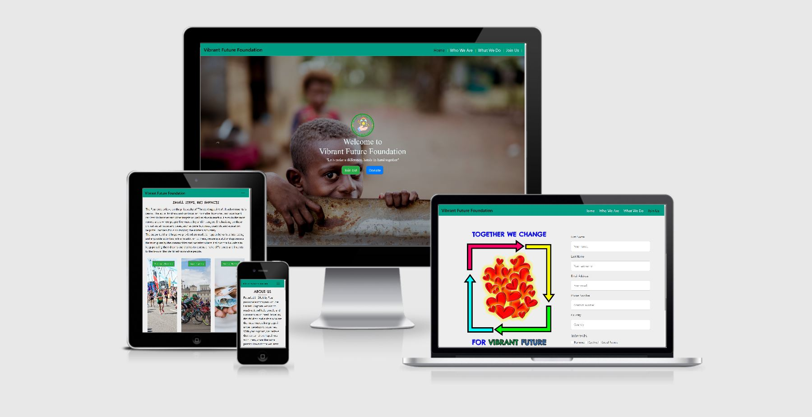

# **Vibrant Future Foundation**


## **Purpose/Aim**

Raise awareness about the vulnerable communities of elderly and children who are less fortunate and without any support from their family or close relatives.
These peoples are in difficulties, negleted and unable to be self sufficient due to poverty, illness, disability and even wars. "Vibrant Future Foundation"
was originally formed to provide help, aids and any possible support for both financially and mentally to those vulnerable people around the world and specially
in underdeveloped and poor countries.

With this aim in mind, I have decided to build this website as a platform to support the foundation so that we can grab more attentions and
receiving greater/wider support from the various people and corporations as well as possible future collaborations.

Main purpose of this website is to let people around us to know about this foundation and at the same time to plant awareness
of real social issues in the communities and broader societies.
Also, share the information on how we help people and no matter what the size of the support from everyone, big or small, would
be valuable and appreciated act of kindness so that more people will engage and be attracted with our aims and we can extensively
help people around the world.

# User Experience(UX)

## User Stories
**First Time User Goals**
- As a First Time User of this site, I want to easily navigate the site across all pages
- As a First Time User of this site, I want to be able to understand the history of this Foundation, 
get to know or get familiar with the founders about their motivations to start this Foundation
- As a First Time User of this site, I want to know vision and mission of Foundation

**Frequent User Goals**
- As a Frequent User of this site, I want to easily navigate the site across all pages
- As a Frequent User of this site, I want to find new inspirations and ideas on what I can do to make a difference to someone's life by doing small help through this Foundation
- As a Frequent User of this site, I want to be able to continue the donations for the greater causes for this Foundation
- As a Frequent User of this site, I want to get information on future activities on new charitable or volunteering activities
- As a Frequent User of this site, I want to get connected with foundation by using social media.

**Return User Goals**
- As a Return User of this site, I want to easily navigate the site across all pages
- As a Return User of this site, I want to be able to Join or Sign-Up as a member
- As a Return User of this site, I want contribute towards the donations raised by this Foundation 
- As a Return User of this site, I want to be able to contact the founders or administrator to answer any query I may have relating to this Foundation

## Design 
  
 **Main colours used throughout the pages are Light shade gray, Green and Black.**
   - Light shade of gray colour used for background colour, green colour used for Navigation bar and black colour as main font colour.

## Typography

- Chelsea Market and PT Sans fonts are two font types used throughout the whole website with Sans Serif as the fallback font in case for any reason the font isn't being imported into 
the site correctly, Chelsea Market font used for all the headings and PT Sans font used for all the paragraph texts.


## Wireframes

- As an initial process of the project design, wireframes were created for desktop, iPad and mobile screen sizes using [Balsamiq](https://balsamiq.com/).

  * Desktop Wireframe - [View](assets/images/wireframe-desktop.pdf)

  * iPad Wireframe - [View](assets/images/wireframe-ipad.pdf)

  * Mobile Wireframe - [View](assets/images/wireframe-mobile.pdf)


## Technologies Used

### Languages Used

-   [HTML5](https://en.wikipedia.org/wiki/HTML5)
-   [CSS3](https://en.wikipedia.org/wiki/Cascading_Style_Sheets)

### Frameworks, Libraries, Programs and Resources Used

1. [Bootstrap 4.4.1:](https://getbootstrap.com/docs/4.4/getting-started/introduction/)
    - Bootstrap was used to assist with the responsiveness and styling of the website.
1. [Hover.css:](https://ianlunn.github.io/Hover/)
    - Hover.css was used on nav-items of navbar to add the wobble bottom transitions while being hovered over.
1. [Google Fonts:](https://fonts.google.com/)
    - Google font was used to embed the Chelsea Market and PT Sans font types which are used on all pages throughout the website.
1. [Font Awesome:](https://fontawesome.com/)
    - Font Awesome was used to add icons for aesthetic and UX purposes.
1. [jQuery:](https://jquery.com/)
    - jQuery came with Bootstrap to make the navbar responsive.
1. [Popper.js](https://popper.js.org/) 
    - Popper.js was used for navbar and modal
1. [Balsamiq:](https://balsamiq.com/)
    - Balsamiq was used to create the wireframes during the design process.
1. [Gitpod](https://www.gitpod.io/)
    - Gitpod was used as IDE for local development.
1. [GitHub:](https://github.com/)
    - GitHub was used to store the projects code after being pushed from Gitpod.
1. [Github Pages](https://pages.github.com/)
    - Github pages were used for deployment of the website
1. [HTML Formatter](https://htmlformatter.com/) 
    - HTML formatter was used to format HTML code

## **Testing**
Testing was carried out throughout the building process to ensure website was responsive at relevant breakpoints using [Chrome Developer Tools](https://developers.google.com/web/tools/chrome-devtools).
The below tools were used at various points throughout the build process:

- [W3C Markup Validation](https://validator.w3.org/#validate_by_input) 
  - W3C Markup Validation was used throughout the process to validate HTML codes
- [W3C CSS Validation](https://jigsaw.w3.org/css-validator/) 
  - W3C CSS Validation was used to vaildate CSS codes
- [Unicorn Revealer](https://chrome.google.com/webstore/detail/unicorn-revealer/lmlkphhdlngaicolpmaakfmhplagoaln/related) 
  - Unicorn Revealer tool was used to identify any overflow issues
- [Lighthouse](https://developers.google.com/web/tools/lighthouse)
  - Lighthouse was used to test the performance and loading speed of the website


### Testing User Stories from User Experience (UX) Section 

#### First Time User Goals

##### As a First Time User of this site, I want to easily navigate the site across all pages

1. _Upon entering the site, users are automatically greeted by the navigation bar at the top of the page(s) which contains menu items, linked to the pages of the site and allow users to access the page(s) of their choice._
2. _All the menu items to access the pages tested to ensure those took the users to the correct pages._

##### As a First Time user of this site, I want to be able to understand the history of this Foundation, get to know or get familiar with the founders about their motivations to start this Foundation

1. _Who We Are option from menu item of navbar will take user to the second page where 'About Us’ section greeted the users with history of this Foundation, user would be able to know history of foundation in more depth by clicking the read full story button on this page. Meet the Founders’ section displays to introduce the founders to users with photos of the founders and flag images._
2. _Button was tested to ensure it trigger the modal upon clicking. Also, tested that button and modal are responsive on small devices and visible clearly._
3. _All the images were tested to ensure they are loading properly, responsive on small devices and not overlapping to each others._

#### Frequent User Goals

##### As a Frequent user of this site, I want to find new inspirations and ideas on what I can do to make a difference to someone's life by doing small help through this Foundation
     
1. _What We Do page of this website gives user with some inspirations and ideas to support others by participating to various activities, three different images of running, cycling and fund raising are displayed with texts overlay on them and texts have very motivitional messages which encourage users to involve into such activities. Additionally a button below images can be clicked to find out more on how founders are contributing towards the charity fund._
2. _All three images were tested to ensure they display collectly and loading quickly, also overlay effect was tested to ensure it is effective and all three overlay effects are exactly same. most importantly overlay effect was tested on various small screen size to ensure there is no issue with text overflowing outside of image._
3. _Button was tested to ensure it triggers the modal upon clicking on it and modal was also tested to ensure images on the gallery section inside the modal are loaded properly and displayed correctly across all devices._

##### As a Frequent user of this site, I want to be able to continue the donations for the greater causes for this Foundation

1. _Donate button on the home page gives an option to donate, upon clicking on this button, modal will trigger the form and users can easily donate to charity by submitting the donation form._
2. _Donate button was tested to ensure it triggers the modal and pop up the form on the screen immediately, all the input elements on the forms were tested to ensure that error message appear if missing input element or incorret format used for email and contact number while completing the form._

##### As a Frequent user of this site, I want to get information on future activities on new charitable or volunteering activities

1. _The Sign Up section offers the user the option to sign up to get information on future activities of charity, user will just need to click on sign up button and provide their name and email and submit the form._
2. _Sign Up button on all the pages were tested to ensure modal trigger upon clicking on the button and form pop up on screen, input elements on the forms were tested to ensure that error message appear if missing input element or incorret email format used while completing the form._

##### As a Frequent user of this site, I want to get connected with foundation by using social media.

1. _Social media icons on the media section of Who We Are , What We Do and Join Us pages offer users to follow the Foundation on socila media, each icon will take users to their login page window upon clicking on the icons._
2. _Each social media icon was tested to ensure new window with login page open on the browser once the icon clicked._

#### Return User Goals

##### As a Return user of this site, I want to be able to Join or Sign-Up as a member

1. _Join Us button of the Home page directly takes users to the Join Us page of the website, alternatively users can also join by selecting Join Us menu item on navbar which displayed on every pages, users would need to complete a simple form and then click Join Us button at the bottom of the form._
2. _Button on the Home page was tested to ensure that it will take user to Join Us oage opon clicking it, input elements on the forms were tested to ensure that error message appear if missing input element or incorret email or phone number format used while completing the form. Also, form was tested on mobile devices to ensure that form is displayed correctly, image on this page is hidden and [form is appear directly on screen](assets/images/form.jpg) while viewing the page on mobile devices._

##### As a Return user of this site, I want to be able to contact the founders or administrator to answer any query I may have relating to this Foundation 

1. _Email address and contact numbers of the Foundation are provided on the pages, users can contact the founders directly using the icons of mail and phone displayed on the pages. When users click on the mail icon, browser will redirect user to Gmail login page and Whatsapp login page will appear on the new window when users click on the phone icon._
2. _Contact section, mail and phone icon was tested on small devices to ensure they are responsive and displayed correctly, also test was carried to ensure mail and phone icon will take users to the corect pages._


### Further Testing
- The website was tested on Google Chrome, Internet Explorer, Microsoft Edge and Safari browsers.
- The website was viewed on a variety of devices such as Desktop, Laptop, iPhone 6, iPhone 11 and iPad.
- A large amount of testing was done to ensure that all pages were linked correctly.
- Friends and family members were asked to review the website and contents to point out any bugs and/or user experience issues.


## Features

### Navigation Bar

The navigation bar is positioned at the top of each page, contains title and main menu of the website, which allows users to easily navigate and access all important pages
and information regarding the website itself in just one click. Navbar has four menu items which are Home, Who We Are, What We Do and Join Us, each menu in the navigation bar would display visual indication of the current open page by changing the colour
compares to other menus.

### Media Section

This section is repeated at the end of the content section of Who We Are, What We Do and Join Us pages which has sign up, social media links and contact options to the users. 
   
* _Sign-Up_ 

This part provides access to the Foundation’s newsletter for upcoming events and interesting updates by clicking the ‘Sign Up’ button and the form would pop-up in the centre of
the page to allow the users to submit their name and email address for the Foundation to send the newsletter directly to their personal email account.

* _Social Media_

This part allows the users to stay connected with the Foundation by following and subscribing the accounts of Foundation’s social media, such as Facebook, Twitter, YouTube and
Instagram. The icons displayed of those social media in this page would also redirect the users to access those social media’s websites in just one click.

* _Get in Touch_

This part is allowing the users to directly contact the administrator of the Foundation for further information and any queries, such as donations, events, collaborations, etc.
The users would be able to send emails and give phone calls which would accommodate more personal and customize information, support, aids and even discussions related to the activities perform
by the Foundation. Mail icon diaplay on this section would redirect the users to gmail login page and phone icon would redirect the users to whatsapp login page in just one click.

### Footer 

The footer is positioned at the bottom of the each page and contains remark and copyright of the website to the developer.

### Home Page
**Background Image**

The background image of landing page is carefully selected to show the users about fundamental issues and cases which are happening around the world. The bright boy in the background
image is the aim of the Foundation to keep putting the efforts, gathering the support and donations to change the world to be less intimidating for the vulnerable groups of people.

**Contents**

Home page is the landing page to welcome the users who access the website. The display contents are simple and concise which able to give a quick brief and look on the purposes
of the Foundation. The Foundation logo becomes the centre point of this page and follows by the slogan to inform the users about the key message which the Foundation is trying to deliver.
this website aim to attract as many users to involve and support to the charity therefore join now and donate button also added to the home page which allow user to join and donate easily.
join now button will take users to the last page of the website where user will be able to fill out the form to join the charity, in a similar way, donation form will pop up on the screen 
when users click on donate button which created using bootstrap modal.


### Who We Are Page

**Section 1 – About Us**

The first section of page 2-Who We Are is to inform the users about the background and the purpose of establishing the Foundation. This section serves as introduction for the
users to learn about the journey of establishing the Foundation and the basic principles believe by the Founders and their aspirations to support the targeted communities and societies.
In addition, a button is added to this section and when button clicked, modal will pop up on the screen which gives process glimpse of forming the logo and slogan show in the page 1-Home and explain the important meaning behind the selected colours of the final logo for
the Foundation

**Section 2 – Meet the Founders**

The second section of page 2-Who We Are introduce the Founders to the users and letting the users to get to know the people who have been developing and establishing the Foundation until now. 
This section shows some details of the Founders, such as photos, names and countries of residency to allow the users to be familiarized themselves with the Founders.

**Section 3 – Clarity**

* _Our Coverage_

This part gives information of the area coverage of the support and aid provide by the Foundation.

* _Our Target_

This part gives information of the target groups, communities and societies where the Foundation would provide the support and helps which have been gathered from various
different sources and benefactors.

* _Our Approach_

This part specifies the information about issues and cases raised within the targeted groups which lead to the best possible approaches taken to support and solve it by
the Founders and any interested benefactors.

**Section 4 - Media Section**

**Section 5 - Footer Section**

### What We Do Page

**Section 1- Small Steps, Big Impacts**

This first section of page 3-What We Do is to discuss the philosophy, various initiatives and involvements undertaken by the Founders. The title of this section has made it clear that
regardless how small the support and donations, those can actually bring massive impacts to tackle any social issues and provide great aids to the vulnerable people in various locations.
With this in mind, those support provided would eventually able to change someone’s life for a better and brighter future which might help them to dream and have hopes again to continue their lives.

**Section 2 – Activities**

* _Vivacious Running_

The image displayed is the exact representative of the activity which enjoys by the Founders and allow them to meet wider crowds on the local events. This local events are becoming 
important milestones for the Foundation to introduce and attract various backgrounds to contribute and collaborate as well as raise awareness on critical issues and cases identified. 
Benefits and important message of running are being specified using the overlay text on the image itself.

* _Super Cycling_

The image displayed is the exact representative of the activity which enjoys by the Founders as a hobby and get together activity since the early day of the establishment of the Foundation.
With the overlay text of the image explaining the health benefits of cycling, the Founders are trying to encourage more people to take part in the reduction of pollutions and global warming.
	
* _Fund as We Go_

This is one of the most important and critical activities executed by the Founders where the donations gathered or collected are being effectively utilized and shared to help the vulnerable 
targets. The Foundation has made it clear that the principles of visibility and transparency are the supreme keys to ensure the aids would reach to the appropriate people by adding the overlay
text on the displayed image.

* _button_

A button is added at the end of the activities section, upon clicking on this button, modal will pop up and users would be able to see some inspiring images about how founders have been raising the funds for the Foundaation.

**Section 3 – Vision and Mission**

This third section of page 3-What We Do is to brief the users on the vision and mission of the Foundation. This allows users to get closer look towards the important of all the initiatives and 
activities specified in previous sections.

**Section 4 - Media Section**

**Section 5 - Footer Section**

### Join Us Page

**Section 1 – Image**

The image is specially designed to convey the important message of 'Together we change for vibrant future' to encourage and become reminder of great outcomes which can be achieved together by the Founders and the users as benefactors by continuing the cycle of kindness and contributions as well as spreading love to the people, communities, societies around the world.
Image on this section set to be hidden on mobile devices to ensure users do not have to spend extra time scrolling further down on the page to complete the form to join.

**Section 2 – Join Us Form**

The form allows the users to register to the Foundation as members and able to stay connected and get updates regarding any activities and events attended or organized by the Foundation. Using this form, the users would be categorized as active users, therefore able to get notification to contribute towards the donations for good cause through the Foundation. There are several fields in the form which can be filled-in to collect personal information about the users, such as first name, last name, email address, phone number, country and interests.
All the input fields on the form are mandatory and message will pop up on the screen to inform user if user try to submit the form without completing the correct input field. This form is created using HTML and CSS only and not functioning yet.

**Section 3 - Media Section**

**Section 5 - Footer Section**

## Future Features to be Implemented
- Add new pages to website specially for image and video purpose, which allow owner to include more images and videos of Events or any programme that organized by the Foundation.
- Add new page with Contact Us section in order for the Foundation to interact and communicate with users more easily and oftenly.
- Hero image on Landing page to be customize further, 3 or 4 images will be used for hero image using some animation effect on them.

## Issues and Resolutions

#### The following issues were identified and resolved throughout the build process.

  - Text inside the Join Us button on the Home page had an issue as text not align properly, same class was used and same style applied in css for both Join now and Donate button however donate button did not show any issue and only join us button shown an issue.
    - Issue fixed by changing height of button to auto.

  - While inspecting on iPad pro display using dev tool, most of the content shrink and resulted excess white space below the footer section of Who We Are and Join Us pages.
    - Issue was fixed by using media query, min-width and max-width values used in media query to target only iPad Pro display.

  - There was also an excess white space on the bottom of content section of all pages except home page while display switched to iPad Pro.
    - Issue was fixed by adding border-bottom value to all content container in style.css : border-bottom value set to double for all IDs 
    relevant to the content containers of the pages which fixed the issue.

  - Text overflow issue on What We Do page as text overlay on all 3 images overflown from those images while switching display to extra small screen size.
    - Issue was fixed by using media query - font size of the texts reduced for extra small screen size using media query, which fixed the issue.

  - Margin issue with phone and mail icon in front of the contact number and email address on media section of Join Us page which cause icon and text displayed very close and no space between one another, same codes were used on all pages and no similar issue noticed, however only Join Us page identified with this issue.
    - Missing mr-2 class to the i elements on join.html page, issue fixed once added mr-2 class.

  - Slightly noticable whitespace below footer on 'Who We Are' page while switching display to iPad which could be just an optical illusion or any possible error.
    - Issue not yet resolved.

  - While I ran Lightouse using dev tool, Home page has performance score below 90% which I was not satisfied as the aim was to score above 90% as the bare minimum.
    - Issue could not addressed further : as per Lighthouse recommendation, I tried to [compress the image](assets/images/compressed-image.JPG) however I could not get the desire image in terms of quality and size after compression therefore could not make improvement as image was tested across all devices and no issue identified in terms of image loading time.
    Also, lower score in Lighthouse report was caused by [vendor scripts](assets/images/lighthouse-issue.jpg) added to my page (Bootstrap, Fontawesome etc) which was not possible to be removed from the page. 
  
  - **Internet Explorer** showed an issue on Home page, while testing the page, [Content of the home page and logo did not display correctly](assets/images/homepage.jpg) in the centre, instead displayed vertically.
    Also, Donate and Sign up forms showed an [issue with placeholder text](assets/images/modal.jpg) as placeholder text not displaying correctly, gallery section on the What We Do page which trigger by button below images also showed large excess space below images.
    - Issue not yet resolved

  - **Mozilla Firefox** **Internet Explorer** showed an issue with images on What We Do page as blur-effect that used on image did not work.
    - After reaching out with tutor support, mentor and doing my own reaserach I have found that backdrop-filter property that I initially used in my style.css for blur effect only supported on **Google Chrom** which resulted diffrent outcome on page while viewing on **Mozilla Firefox**, **Internet Explorer** and also on **iPad** . I have therefore removed backdrop-filter property from my style.css, instead i have used background property and add background of #495057cc to image-overlay class which ressolved an issue.  
 
  -  Small [horizontal line](assets/images/social-icon-error.jpg) appears next to bottom-right of each social media icons of the page while hovering over those icons, which i did not add neither i wanted those to be appear.
    - Issue fixed by adding text decoration property in style.css to the social media icons : text-decoration value set to none which fixed an issue.

    ```
    .list-inline-social a  {
    text-decoration: none;
    }
    ```

## Deployment

### GitHub Pages

The project was deployed to GitHub Pages using the following steps...

1. Log in to GitHub and locate the [GitHub Repository](https://github.com/)
2. At the top of the Repository (not top of page), locate the "Settings" Button on the menu.
3. Scroll down the Settings page until you locate the "GitHub Pages" Section.
4. Under "Source", click the dropdown called "None" and select "Master Branch".
5. The page will automatically refresh and the website is now deployed.
6. Scroll back down to the GitHub Pages section to retrive the link to the deployed website.


### Making a Local Clone

1. Log in to GitHub and locate the [GitHub Repository](https://github.com/)
2. Under the repository name, click "Clone or download".
3. To clone the repository using HTTPS, under "Clone with HTTPS", copy the link.
4. Open Git Bash
5. Change the current working directory to the location where you want the cloned directory to be made.
6. Type `git clone`, and then paste the URL you copied in Step 3.

```
$ git clone https://github.com/shiva123-coder/Vibrant-Future-Foundation-.git
``` 

7. Press Enter. Your local clone will be created.
```
$ git clone https://github.com/shiva123-coder/Vibrant-Future-Foundation-.git
Cloning into 'Vibrant-Future-Foundation-'...
remote: Enumerating objects: 704, done.
remote: Counting objects: 100% (704/704), done.
remote: Compressing objects: 100% (401/401), done.
remote: Total 704 (delta 357), reused 565 (delta 224), pack-reused 0
Receiving objects: 100% (704/704), 14.09 MiB | 3.85 MiB/s, done.
Resolving deltas: 100% (357/357), done.

```

Click [Here](https://help.github.com/en/github/creating-cloning-and-archiving-repositories/cloning-a-repository#cloning-a-repository-to-github-desktop) to retrieve pictures for some of the buttons and more detailed explanations of the above process.


## Credit

* Background image on the Home page was taken from [Unsplash](https://unsplash.com/photos/PAiVzSmYy-c), credit to Ben White for uploading this picture to [Unsplash](https://unsplash.com/)
 
* Four images of the Founders on Who We Are page are the true images of Founders of the Foundation and all of the Founders were happy to publish their images on website, thanks to everyone
 
* Image of flag of Nepal which is displayed below the images of Founders on Who We Are page were taken from [Google](https://www.google.com/search?q=flag+of+nepal&rlz=1C1CHBF_en-GBGB881GB881&sxsrf=ALeKk02jALv28pQWx0SJ_wWS8Z0ZifdW7w:1605524058842&source=lnms&tbm=isch&sa=X&ved=2ahUKEwjNitKZ84btAhUrVRUIHaVEAicQ_AUoAXoECBEQAw&biw=1920&bih=969) and modified as per project requirement using powerpoint

* Image of flag of the UK which is displayed below the images of Founders on Who We Are page were taken from [Google](https://www.google.com/search?q=flag+of+uk&rlz=1C1CHBF_en-GBGB881GB881&sxsrf=ALeKk03nNHin4cq4Z6qlORbyjWHf2nxyTQ:1605524377976&source=lnms&tbm=isch&sa=X&ved=2ahUKEwj2xOix9IbtAhVCThUIHabHBGUQ_AUoAXoECA4QAw&biw=1920&bih=969) and modified as per project requirement using powerpoint
  
* First image of running on What We Do page was taken from [Coachmag](https://www.coachmag.co.uk/marathon-training/6520/london-marathon-ballot)
 
* Second Image of cycling on What We Do page was taken from google images of [london prudential ride](https://www.google.com/search?q=london+prudential+ride+images&rlz=1C1CHBF_en-GBGB881GB881&sxsrf=ALeKk03nYavIJg2EzgahHj3ulAokn_ZrrQ:1605527548092&source=lnms&tbm=isch&sa=X&ved=2ahUKEwiThrmZgIftAhXCUBUIHWXHBRkQ_AUoAnoECAgQBA&biw=1920&bih=969#imgrc=nSP_iZ-JsBdMNM)
 
* Third image of fund collection on What We Do page was taken from [Unsplash](https://unsplash.com/photos/Y_x747Yshlw), thanks to Christian Dubovan for uploading this image to [Unsplash](https://unsplash.com/)
 
* Some of the text contents in Vision section of What We Do page were taken from [Charity Navigator Page](https://www.charitynavigator.org/index.cfm?bay=content.view&cpid=17)
 
* Thanks to dcode for [youtube video](https://www.youtube.com/watch?v=exb2ab72Xhs) on Image Hover Text Overlay effect - I have used some codes and concepts from this video for What We Do page while creating overlay effect on image 

* Thanks to Academind for [youtube video](https://www.youtube.com/watch?v=23bpce-5s8I) on Bootstrap Navbar concepts which was really helpful for me to understand on making Navbar responsive. 

* Concept of having number pattern as required element for phone number while creating form for Join Us page was taken from [Codegrepper Page](https://www.codegrepper.com/code-examples/html/html+phone+number+input)
 
* Credit to [W3School](https://www.w3schools.com/default.asp) page as I have accessed this page throughout the process which was really helpful for resolving an issue on several occasion, I have also taken the [HTML code from W3school](https://www.w3schools.com/html/html_forms.asp) while creating form for Join Us page and modified as per project requirement


## Acknowledgements

I would like to thank everyone on the Code institute Slack channels, tutor support team and massive thank to my Mentor [Mark Railton](https://github.com/railto).

## Disclaimer

All images and contents of the website are educational purposes only.