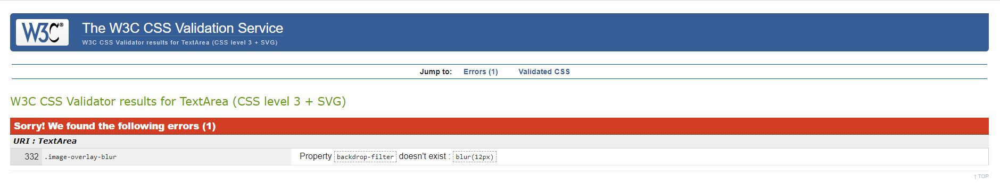

# **Vibrant Future Foundation**

## **Purpose/Aim**

Raise awareness about the vulnerable communities of elderly and children who are less fortunate and without any support from their family or close relatives.
These peoples are in difficulties, negleted and unable to be self sufficient due to poverty, illness, disability and even wars. "Vibrant Future Foundation"
was originally formed to provide help, aids and any possible support for both financially and mentally to those vulnerable people around the world and specially
in underdeveloped and poor country.

With this aim in mind, I have decided to build this mock-up website as a platform to support the foundation so that we can grab more attentions and
receiving greater/wider support from the various people and corporations as well as possible future collaborations.

Main purpose of this website is to let people around us to know about this foundation and at the same time to plant awareness
of real social issues in the communities and broader societies.
Also, share the information on how we help people and no matter what the size of the support, big or small, from everyone would
be such a valuable and appreciated act of kindness so that more people will engage and be attracted with our aim and we can extensively
help people around the world.

## User Stories

- As a user of this site , I want to easily navigate the site across all pages
- As a user of this site , I want to be able to understand the history of this foundation
- As a user of this site , I want to know or get familier with the founders about their motivations to start this foundation
- As a user of this site , I want to know mission and vision of Foundation
- As a user of this site, I want inspiration and ideas on what I can do to make a difference to someone's life by doing small help
- As a user of this site, I want to easily Join or Sign-Up as a member
- As a user of this site, I want to be able to donate for the good acts of this foundation
- As a user of this site, I want to get information on future activities on charitable or voluntering activities
- As a user of this site, I want to be able to contact the founders or administrator to answer any query i may have

---

## Design 
  
- Main colours used throughout the pages are black, white , green and sky blue.

## Typography

- Chelsea Market and PT sans fonts are two fonts used throughout the whole website with Sans Serif as the fallback font in case for any reason the font isn't being imported into 
the site correctly, Chelsea Market font used for all the headings and PT sans font used for all the paragraph text.

## Wireframes

- As a initial process of the project design , wireframes were created for Desktop, iPad and Mobile screen sizes using [Balsamiq](https://balsamiq.com/).

  * Desktop Wireframe - [View](assets/images/wireframe-desktop.pdf)

  * iPad Wireframe - [View](assets/images/wireframe-ipad.pdf)

  * Mobile Wireframe - [View](assets/images/wireframe-mobile.pdf)

## Technologies Used

### Languages Used

-   [HTML5](https://en.wikipedia.org/wiki/HTML5)
-   [CSS3](https://en.wikipedia.org/wiki/Cascading_Style_Sheets)

### Frameworks, Libraries, Programs and Resources Used

1. [Bootstrap 4.4.1:](https://getbootstrap.com/docs/4.4/getting-started/introduction/)
    - Bootstrap was used to assist with the responsiveness and styling of the website.
1. [Hover.css:](https://ianlunn.github.io/Hover/)
    - Hover.css was used on nav-items of navbar to add the wobble bottom transitions while being hovered over.
1. [Google Fonts:](https://fonts.google.com/)
    - Google font was used to embed the Chelsea Market and PT Sans font which is used on all pages throughout the project.
1. [Font Awesome:](https://fontawesome.com/)
    - Font Awesome was used to add icons for aesthetic and UX purposes.
1. [jQuery:](https://jquery.com/)
    - jQuery came with Bootstrap to make the navbar responsive.
1. [Popper.js](https://popper.js.org/) 
    - Popper.js was used for navbar and modal
1. [Balsamiq:](https://balsamiq.com/)
    - Balsamiq was used to create the [wireframes](https://github.com/) during the design process.
1. [Gitpod](https://www.gitpod.io/)
    - Gitpod was used as IDE for local development.
1. [GitHub:](https://github.com/)
    - GitHub was used to store the projects code after being pushed from Gitpod.
1. [Github Pages](https://pages.github.com/)
    - Github pages were used for deployment of the website
1. [HTML Formatter](https://htmlformatter.com/) 
    - HTML formatter was used to format HTML code

## **Testing**
Testing was carried out throughout the building process to ensure site was responsive at relevant breakpoints using [Chrome Developer Tools](https://developers.google.com/web/tools/chrome-devtools).
The below tools were used at various points throughout the build:

- [W3C Markup Validation](https://validator.w3.org/#validate_by_input) 
  - W3C Markup Validation was used throughout the process to identify validate HTML
- [W3C CSS Validation](https://jigsaw.w3.org/css-validator/) 
  - W3C CSS Validation was used to vaildate CSS Code
- [Unicorn Revealer](https://chrome.google.com/webstore/detail/unicorn-revealer/lmlkphhdlngaicolpmaakfmhplagoaln/related) 
  - Unicorn Revelar tool was used to identify any overflow issues
- [Lighthouse](https://developers.google.com/web/tools/lighthouse)
  - Lighthouse was used to test the performance and loading speed of the website

**Manual Testing**

*Navigation Bar

 - 

## Features

### Navigation Bar

The navigation bar is positioned at the top of each page, contains title and main menu of the website, which allows users to easily navigate and access all important pages
and information regarding the website itself in just one click. Navbar has four menu items which are Home , Who We Are , What We Do and Join Us, each menu in the navigation bar would display visual indication of the current open page by changing the colour
compares to other menus.

### Media Section

This section is repeated at the end of the content section of every page which has sign up , social media links and contact options to the users. 
   
* _Sign-Up_ 

This part provides access to the Foundation’s newsletter for upcoming events and interesting updates by clicking the ‘Sign Up’ button and the form would pop-up in the centre of
the page to allow the users to submit their name and email address for the Foundation to send the newsletter directly to their personal email account.

* _Social Media_

This part allows the users to stay connected with the Foundation by following and subscribing the accounts of Foundation’s social media, such as Facebook, Twitter, YouTube and
Instagram. The icons displayed of those social media in this page would also redirect the users to access those social media’s websites in just one click.

* _Get in Touch_

This part is allowing the users to directly contact the administrator of the Foundation for further information and any queries, such as donations, events, collaborations, etc.
The users would be able to send emails and give phone calls which would accommodate more personal and customize information, support, aids and even discussions related to the activities perform
by the Foundation. 

### Footer

The footer is positioned at the bottom of the each page and contains remark and copyright of the website to the developer.

###  1. Home

**Background Image**

The background image of landing page is carefully selected to show the users about fundamental issues and cases which are happening around the world. The bright boy in the background
image is the aim of the Foundation to keep putting the efforts, gathering the support and donations to change the world to be less intimidating for the vulnerable groups of people.

**Contents**

Home page  is the landing page to welcome the users who access the website. The display contents are simple and concise which able to give a quick brief and look on the purposes
of the Foundation. The Foundation logo becomes the centre point of this page and follows by the slogan to inform the users about the key message which the Foundation is trying to deliver.
this website aim to attract as many users to involve and support to the charity therefore join now and donate button also added to the home page which allow user to join and donate easily.
join now button will take users to the last page of the website where user will be able to fill out  the form to join the charity , in a similar way donation form will pop up on the screen 
when user click on donate button which is created by using bootstrap modal.

### 2. Who We Are

**Section 1 – About Us**

The first section of page 2-Who We Are is to inform the users about the background and the purpose of establishing the Foundation. This section serves as introduction for the
users to learn about the journey of establishing the Foundation and the basic principles believe by the Founders and their aspirations to support the targeted communities and societies.
In addition, this section gives process glimpse of forming the logo and slogan show in the page 1-Home and explain the important meaning behind the selected colours of the final logo for
the Foundation.

**Section 2 – Meet the Founders**

The second section of page 2-Who We Are introduce the Founders to the users and letting the users to get to know the people who have developed and establishing the Foundation until now. 
This section shows some details of the Founders, such as photos, names and countries of residency to allow the users to be familiarized themselves with the Founders.

**Section 3 – Clarity**

* _Our Coverage_

This part gives information of the area coverage of the support and aid provide by the Foundation.

* _Our Target_

This part gives information of the target groups, communities and societies where the Foundation would provide the support and helps which have been gathered from various
different sources and benefactors.

* _Our Approach_

This part specifies the information about issues and cases raised within the targeted groups which lead to the best possible approaches taken to support and solve it by
the Founders and any interested benefactors.

### 3. What We Do

**Section 1- Small Steps, Big Impacts**

This first section of page 3-What We Do is to discuss the philosophy, various initiatives and involvements undertaken by the Founders. The title of this section has made it clear that
regardless how small the support and donations, those can actually bring massive impacts to tackle any social issues and provide great aids to the vulnerable people in various locations.
With this in mind, those support provided would eventually able to change someone’s life for a better and brighter future which might help them to dream and have hopes again to continue their lives.

**Section 2 – Activities**

* _Vivacious Running_

The image displayed is the exact representative of the activity which enjoys by the Founders and allow them to meet wider crowds on the local events. This local events are becoming 
important milestones for the Foundation to introduce and attract various backgrounds to contribute and collaborate as well as raise awareness on critical issues and cases identified. 
Benefits and important message of running are being specified using the overlay text on the image itself.

* _Super Cycling_
The image displayed is the exact representative of the activity which enjoys by the Founders as a hobby and get together activity since the early day of the establishment of the Foundation.
 With the overlay text of the image explaining the health benefits of cycling, the Founders are trying to encourage more people to take part in the reduction of pollutions and global warming.
	
* _Fund as We Go_

This is one of the most important and critical activities executed by the Founders where the donations gathered or collected are being effectively utilized and shared to help the vulnerable 
targets. The Foundation has made it clear that the principles of visibility and transparency are the supreme keys to ensure the aids would reach to the appropriate people by adding the overlay
 text on the displayed image.

**Section 3 – Vision and Mission**

This third section of page 3-What We Do is to brief the users on the vision and mission of the Foundation. This allows users to get closer look towards the important of all the initiatives and 
activities specified in previous sections.

### 4. Join Us

**Section 1 – Image**

The image is specially designed to convey the important message of “Together we change for vibrant future” to encourage and become reminder of great outcomes which can be achieved together by the Founders and the users as benefactors by continuing the cycle of kindness and contributions as well as spreading love to the people, communities, societies and the world. 

**Section 2 – Join Us Form**

The form allows the users to register to the Foundation as members and able to stay connected and get updates regarding any activities and events attended or organized by the Foundation. Using this form, the users would be categorized as active users, therefore able to get notification to contribute towards the donations for good cause through the Foundation. There are several fields in the form which can be filled-in to collect personal information about the users, such as first name, last name, email address, phone number, country and interests.

## Bugfix

**Text inside the Join button on the Home page had an issue as text not align properly , same class was used and same style applied in css for both Join now and Donate button however donate button did not show any issue and only join us button shown an issue.**

*Issue fixed by changing height of button to auto.

**While inspecting on Ipad pro display using dev tool, most of the content shrink and resulted excess white space below the footer section of Who we are and Join Us page.**

* Issue was fixed by using media query , min-width and max-width value used in media query to target only iPad Pro display.

**There was also an excess white space on top and bottom of content section of all pages except home page while display switched to iPad Pro.**

* Issue was fixed by adding border-top and border-bottom value to all content container in style.css : border-top value set to double and border-bottom value set to dashed for all id 
relevenat to the content container of the pages which fixed an issue.

**Text overflow issue on 'what we do' page as text overlay on all 3 images overflown from image while switching device to small screen.** 

* Issue was fixed by using media query - font size of the text reduced for medium and extra small device using media query which fixed an issue.

**Margin issue with phone and mail icon infront of the contact number and email address on  media section of 'Join Us' page which cause icon and text very close and no space between, same codes were used on all pages and no similar issue noticed however only 'Join us' page shown this issue**

* mr-2 class to the i element was missing on join.html page, issue fixed once added mr-2 class.

**Slightly noticable whitespace below footer on 'who we are page' while switching display to iPad , not sure if this is just an optical illusion or has some error**

* Issue not ressolved.

**while ran code through [W3C CSS Validation Service](https://jigsaw.w3.org/css-validator/), Error message appeared on backdrop-filter property of image-overlay-blur class which used in info.html for what we do page**

*issue not ressolved , reached out to tutor support as well and tutor had advised that this could be false result from validator as backdrop-filter property is fairly new and validator has probably not updated yet to look for this rule.